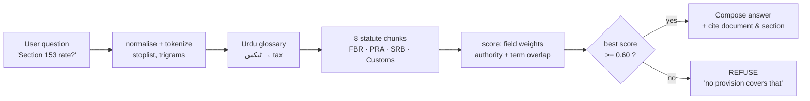

<div align="center">

# PakERP Cloud Suite

**AI-Native ERP & Statutory FBR Tax Engine for Pakistani Manufacturing SMEs**

[](https://factory-copilot-r6xy.vercel.app)
[](./LICENSE)
[](https://react.dev)
[](https://www.typescriptlang.org)
[]

React 19 · Vite 6 · TypeScript 5.8 · Tailwind 4 · Supabase PostgreSQL · Groq (server-side) · Vercel

**Live demo:** https://factory-copilot-r6xy.vercel.app
**Submission PRD for judges:** [HACKATHON_PRD.md](./HACKATHON_PRD.md)

</div>

---

## 1. The problem

A Pakistani textile SME runs its books on a desktop package and its stock on a
notebook. Three things follow, and all three are expensive:

| Problem | Consequence today |
|---|---|
| Nobody re-reads the books | A customer is invoiced twice; a supplier is paid after the price moved |
| The only expert is the owner | When he is travelling, the business stops, because the knowledge is in his head |
| Tax law is read from memory | The wrong rate is applied, and it is discovered at filing time |

Off-the-shelf ERPs do not fix this. A cloth mill in Faisalabad runs on
WhatsApp, a cashbook, and one person who knows the Section 153 withholding
rate. An enterprise ERP costs more than the mill's annual margin, and the tax
module still cannot answer "what rate applies to *this* invoice?"

**PakERP answers all three in one sentence**, in Urdu, Roman Urdu or English:
*what is our stock, what should we buy, and what does the law say about this
invoice?*

The hard part is not answering. It is **answering without inventing**. A wrong
stock figure costs a purchase order. A wrong tax rate costs a penalty. So this
project is built around one rule that everything else obeys:

> **The AI may decide *which* tool answers you. It may never decide what the
> number is.** Money moves only through deterministic, tested functions, and
> nothing reaches the ledger without a person pressing Approve.

---

## 2. RAG architecture

The copilot is not one call to a language model. It is four lanes, and an
utterance lands in exactly one of them.

```
                    ┌──────────────── Voice (MediaRecorder) ────┐
                    │  Urdu / English / Roman Urdu             │
                    └───────────────────┬──────────────────────┘
                                        ▼
                    ┌──────────────────────────────────────────┐
                    │        AGENT SUPERVISOR  (deterministic) │
                    │  intent + domain router · 19-tool schema │
                    └───────┬───────────────┬──────────────┬───┘
        ┌───────────────────┘               │              └──────────────────┐
        ▼                                   ▼                                 ▼
┌────────────────────┐        ┌──────────────────────────┐        ┌────────────────────────┐
│  LEDGER            │        │  GROUNDED RAG            │        │  RESOLVER (miss only)  │
│  businessTools.ts  │        │  src/lib/rag/            │        │  src/lib/ai/           │
│  reads live rows   │        │  8 statute chunks        │        │  offline → Groq        │
│  ⚠ writes? NO      │        │  lexical + trigram       │        │  picks 1 of 19 tools   │
└─────────┬──────────┘        │  Urdu glossary           │        └───────────┬────────────┘
          │                   │  ★ REFUSE below 0.60     │                    │
          │                   └────────────┬─────────────┘                    │
          │                                │                                  │
          │                   ┌────────────▼─────────────┐                    │
          │                   │ "Income Tax Ordinance   │                    │
          │                   │  2001, Fourth Schedule,  │                    │
          │                   │  Part III, Sec 153(1)(a)"│                    │
          │                   └──────────────────────────┘                    │
          ▼                                                                    ▼
┌───────────────────────────────────────────────────────────────────────────────────────┐
│                         CONFIRMATION CARD  —  human-in-the-loop                        │
│   • No silent writes. The card names the stock check, the supplier, and the amount.  │
└─────────────────────────────────────────────────────────────────────┬─────────────────┘
                                                                      ▼
                                                          ┌───────────────────────┐
                                                          │  LEDGER (Supabase)    │
                                                          └───────────────────────┘
```

### The grounded RAG lane, in detail



**Why the gate matters.** Before this lane existed, `ragCompliance.ts` was 88
lines of `if (q.includes('withholding'))` that returned `found: true` with a
hardcoded confidence for *every* input. Asked *"best bowling attack in
Pakistan cricket"*, it confidently returned an 18% match. A confidence gate
that refuses is the difference between a system that knows and a system that
sounds like it knows.

**What the corpus actually contains:** 8 statute chunks, each carrying its
instrument and section verbatim as a citation — *"Income Tax Ordinance 2001,
Fourth Schedule, Part III, Section 153(1)(a)"*, *"Sales Tax Act 1990, Section
3(1)"*, *"S.R.O. 345(I)/2024 …"*.

When the deterministic rules match nothing, the AI gets a turn — **and only a
turn**. It may pick one of 19 registered tools and fill their parameters. It
cannot compute, invent an entity, or write:

```
utterance
   │
   ├─► deterministic rules (exact clauses, order-independent matcher)
   │      miss ↓
   ├─► offline resolver → { tool, params }   ← no API key needed, ships by default
   │      ↓ confidence < 0.55 → refuse
   ├─► Groq resolver (server-held key) → same closed schema
   │
   └─► VERIFY every entity against live ledger → execute the EXISTING tool
```

A model proposing `delete_company`, or `add_customer` with no name, or a
material that is not in the catalogue, is rejected before any code runs. This
is why the previous "hand me every new phrasing" problem is now a settings
screen (**Settings → Teaching**) instead of a code change.

---

## 3. Tech stack

| Layer | Choice | Why this one |
|---|---|---|
| UI | React 19 + TypeScript 5.8 | Strict types across ledger, tax and agent contracts |
| Build | Vite 6 | Fast HMR; the demo must survive live editing |
| Styling | Tailwind CSS 4 | Dark mode + RTL-ready Urdu without a second stylesheet |
| Charts | Recharts | GST reconciliation, volume trends |
| Icons | lucide-react | Consistent icon set |
| Database | Supabase (PostgreSQL) + RLS | Multi-tenant by row-level security, not by convention |
| LLM | Groq — Whisper large-v3 (STT), gpt-oss-120b | Server-held key; low latency for a voice-first product |
| API proxy | Express on `:3001` | Key never reaches the browser |
| Agent runtime | Vercel serverless | — |
| Tests | `node:test` + `tsx` | **398 tests, 0 failing**, no framework lock-in |

**Scale of the codebase:** 107 TypeScript files, ~33,600 lines, 19 test files.

### The AI capability surface — 14 skills, 5 submission flags

| Capability flag | Skills |
|---|---|
| **Agentic AI** | Reorder Forecast — moving-average demand → draft PO, unprompted |
| **AI Workflows** | Ledger Reader · Stock Sufficiency · Purchase Desk · Accounting Books · Master Registry · Screen Control · Document Print |
| **Generative AI** | Compliance RAG (cites, or refuses) · Software Guide |
| **Multi-Agent Systems** | Negotiation Room — buyer agent vs supplier agent |
| **AI-powered BPA** | Anomaly Watch · Material Variance · FBR Payload Builder |

The submission rule asks for **2 skills minimum**. This demonstrates **5**.

---

## 4. How to run locally

```bash
git clone <your-repo-url>
cd Factory-Copilot
npm install
```

### Option A — everything with one command (recommended)

```bash
npm run dev
```

This starts the Groq proxy on `:3001` **and** Vite on `:5173`. Open
**http://localhost:5173**.

### Option B — the API key (optional)

The app is **fully functional with no API key**. Every AI route has a
deterministic offline resolver that ships by default. Add a key only to enable
voice transcription and the live resolver:

```bash
# .env  (never commit this)
GROQ_API_KEY=gsk_...
```

### Demo login

```
admin@gmail.com / admin123
```

If the ledger looks empty, go to **Settings → Reset & Seed Demo** to load the
demo factory.

### Commands

| Command | Does |
|---|---|
| `npm run dev` | API proxy + Vite dev server |
| `npm run build` | Production build |
| `npm run preview` | Serve the production build |
| `npm test` | **398 tests** |
| `npm run lint` | `tsc --noEmit` (typecheck) |

### 🔐 Security

- **Never commit API keys.** `GROQ_API_KEY` is read **only** inside the server
  process and is never sent to the browser. It cannot appear in DevTools,
  localStorage or network traffic.
- `.env` and `dist/` are in `.gitignore`. Use environment variables in your
  hosting provider, not files in the repo.
- Supabase uses **Row Level Security**, not application-level filtering.
- Browser-side AI access is capped by a model allowlist and payload size limits.

---

## 5. Screenshots

> Replace the path below with a committed screenshot of the running app.

<!-- Add `docs/screenshot-dashboard.png` to this repository, then uncomment: -->
<!--  -->
<!--  -->

**What to look at in a live run:**

1. **Executive Dashboard** — six KPI tiles, one per business surface. Card 06
   is the AI Copilot: it lists the registered skills and opens the copilot on
   click.
2. **AI Copilot Terminal** — ask *"did we have proper stock"*. Every answer is
   labelled with the skill that produced it (`Ledger Reader`, `Stock
   Sufficiency`, `Compliance RAG`), because the label is derived from the intent
   rather than written into the text.
3. **Stock check before purchase** — say *"create a purchase order for 200 kg
   cotton yarn"*. Before the confirmation card opens, the copilot says:
   *"Stock check: Cotton Yarn 150D already at 1,450 kg, which covers the 200 kg
   you asked to buy. Ordering anyway?"*
4. **Grounded tax answer** — ask *"Section 153 ka rate?"*. The answer cites the
   Income Tax Ordinance 2001, Fourth Schedule, Part III, Section 153(1)(a).
   Ask something absurd — *"credit card pe tax lagta hai?"* — and it **refuses**.
5. **Autonomous proposal** — the dashboard shows *"1 agent proposal awaiting
   your approval"*. An agent noticed INV-DEMO-1001 has been outstanding 52
   days and proposed flagging it. Nothing is written until you press Approve.
6. **Settings → Teaching** — type a command the copilot doesn't know. It is
   listed, you bind it to a capability in one click, and it works immediately.
   No rebuild, no commit.

---

## 6. Limitations and future improvements

We list these because a judge should not have to find them.

### Known limitations — stated plainly

| Limitation | Why it exists |
|---|---|
| **We are not a licensed FBR integrator.** | Pakistani law reserves transmission to a licensed integrator. We build a **schema-valid payload for your licensed integrator** to transmit. We do not file with FBR and do not claim to. |
| **Material variance is not a weighed physical loss.** | We reconcile *received − issued to production*. A roll that tore on a loom is invisible to the ledger, and the answer says so rather than implying a measurement it never made. |
| **Live LLM route is untested at venue scale.** | Every AI route degrades to a deterministic offline resolver. If the venue network fails, the demo still answers. |
| **Row Level Security migration must be applied manually.** | `supabase/migration-2026-10-rls-hardening.sql` is paste-into-SQL-Editor. Until applied, the ledger hydrates empty on reload. |
| **IDs are timestamp-based.** | `cust_${Date.now()}` can collide across sessions, causing a duplicate-key error on cloud sync. |
| **Demo seed is modest.** | 6 SKUs · 4 suppliers · 3 customers. Enough to demonstrate, not enough to impress a real mill. |

### Future improvements

1. **Batch-level weight reconciliation** — capture input and output weight per
   production batch so variance becomes a *measured* loss.
2. **Credit-check enforcement** — today a credit limit is recorded and
   displayed; nothing blocks an invoice that exceeds it.
3. **Persisted, synced teaching bank** — learned phrases are `localStorage`
   today, so they are per-machine.
4. **Streaming STT** — Whisper transcription currently waits for the full file.
5. **Multi-warehouse and multi-mill** — the schema is single-tenant by
   organisation; a group with two mills needs this.
6. **A real cost model** — moving-average reorder is rule-based; a proper
   demand model would use seasonality, which the current history cannot support.

---

## License

MIT — see [LICENSE](./LICENSE).